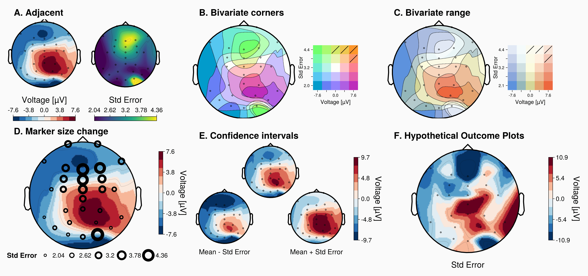

::: {.columns}

::: {.column width="40%"}
## The study

How can uncertainty be added to topoplots without making them harder to read?

This study compares seven uncertainty-visualization approaches using
comparison, detection, and subjective-evaluation tasks.

[Explore the sample](pages/sample.qmd){.btn .btn-primary}
:::

::: {.column width="60%"}
{fig-alt="Animated examples of uncertainty visualizations for topoplots."}
:::

:::

## Site structure

- **[Sample](pages/sample.qmd):** participants and background characteristics.
- **[Task 1](pages/task1.qmd):** visualization comparison and completion time.
- **[Task 2](pages/task2.qmd):** pattern detection and completion time.
- **[Subjective evaluation](pages/subjective.qmd):** participant ratings of the visualizations.
- **[Open-ended feedback](pages/feedback.qmd):** visualization-specific and general written comments.
- **[Publication figures](pages/figures.qmd):** final figures for reuse.
