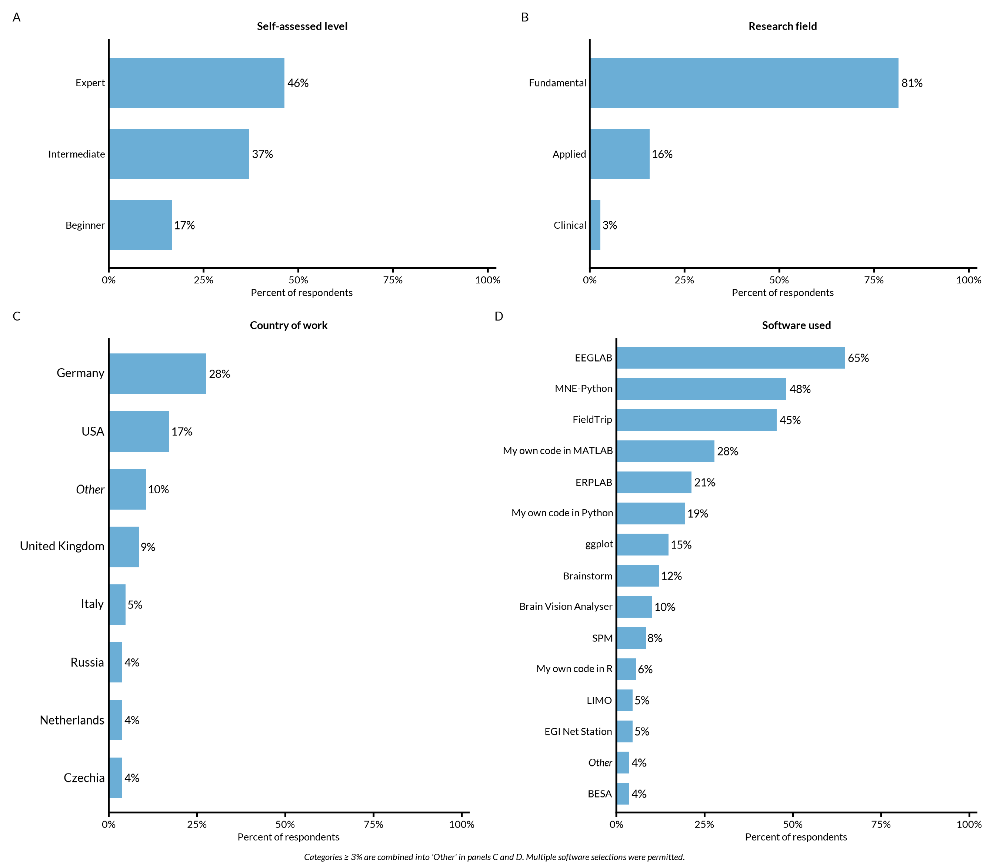
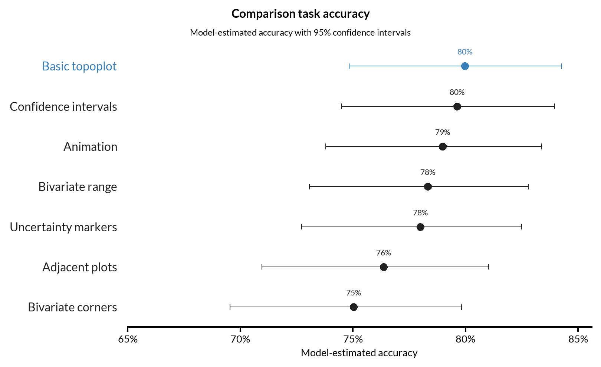
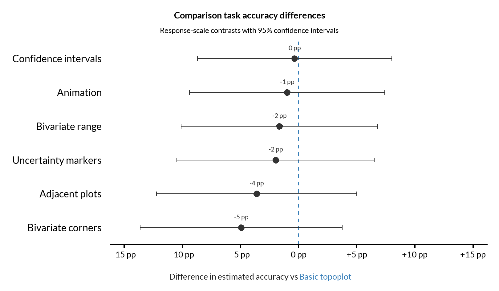
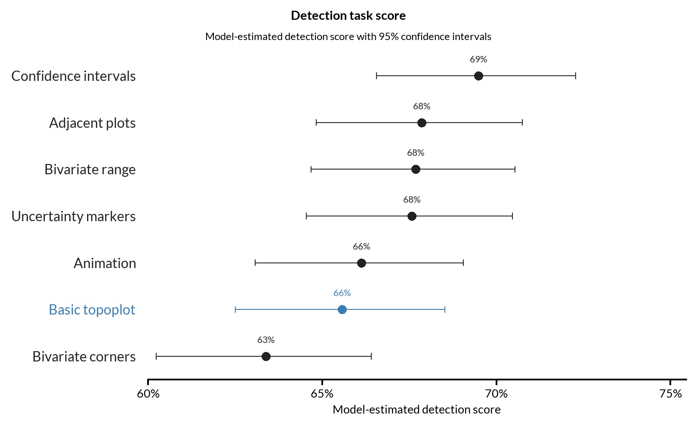
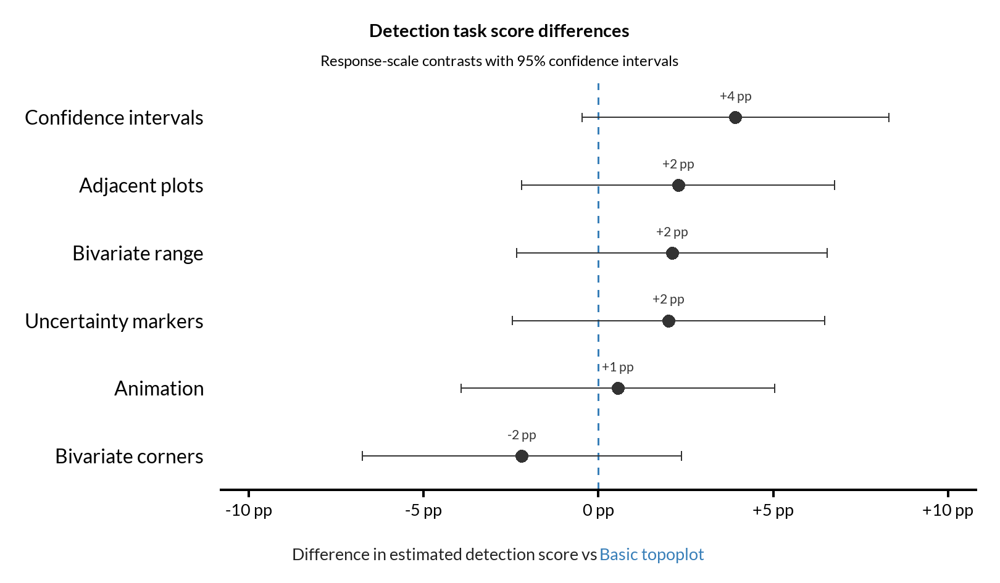
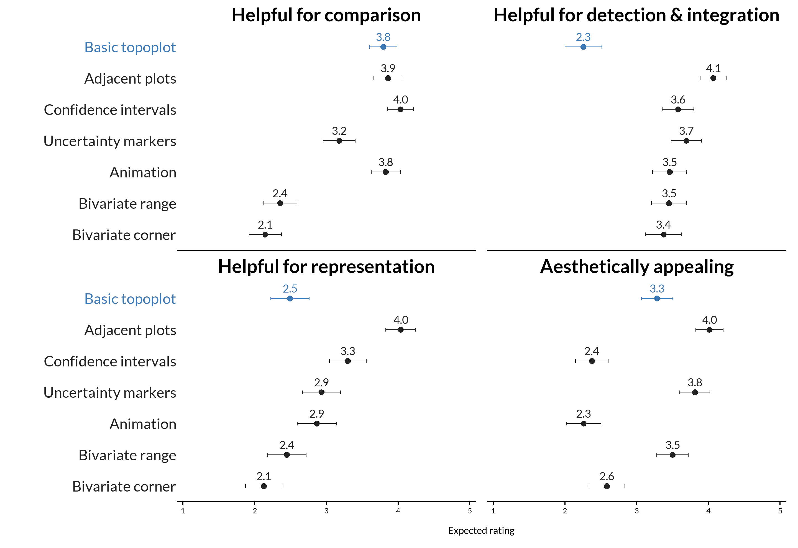
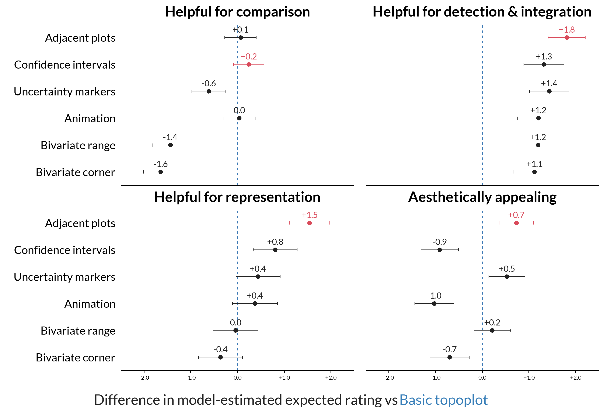

This page contains only the final aggregate figures for copying into
manuscripts, presentations, and other publication materials. Select or open an
image to copy it at full resolution.

## Participant characteristics: categories above 3%

{fig-alt="Participant-characteristics panels showing categories above the specified percentage threshold."}

## Comparison task: model-estimated probability of a correct response

{fig-alt="Model-estimated probability of a correct response for each visualization type, with 95% confidence intervals."}

## Comparison task: differences relative to Basic topoplot

{fig-alt="Differences in model-estimated comparison-task accuracy relative to Basic topoplot, with 95% confidence intervals."}

## Detection-score analysis: estimated values

{fig-alt="Model-estimated detection scores for each visualization type, with 95% confidence intervals."}

## Detection-score analysis: differences relative to Basic topoplot

{fig-alt="Differences in model-estimated detection scores relative to Basic topoplot, with 95% confidence intervals."}

## Model-estimated subjective ratings

{fig-alt="Model-estimated ratings for comparison, detection and integration, representation, and aesthetic appeal."}

## Subjective-rating differences relative to Basic topoplot

{fig-alt="Differences in model-estimated expected ratings relative to Basic topoplot across four subjective-evaluation criteria, with 95% confidence intervals."}
